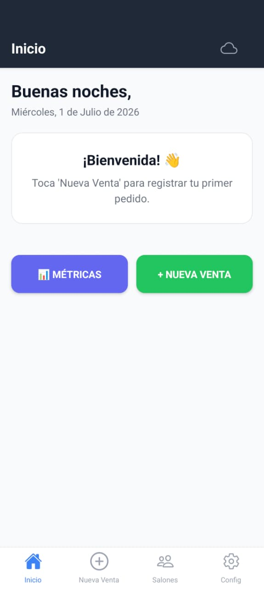
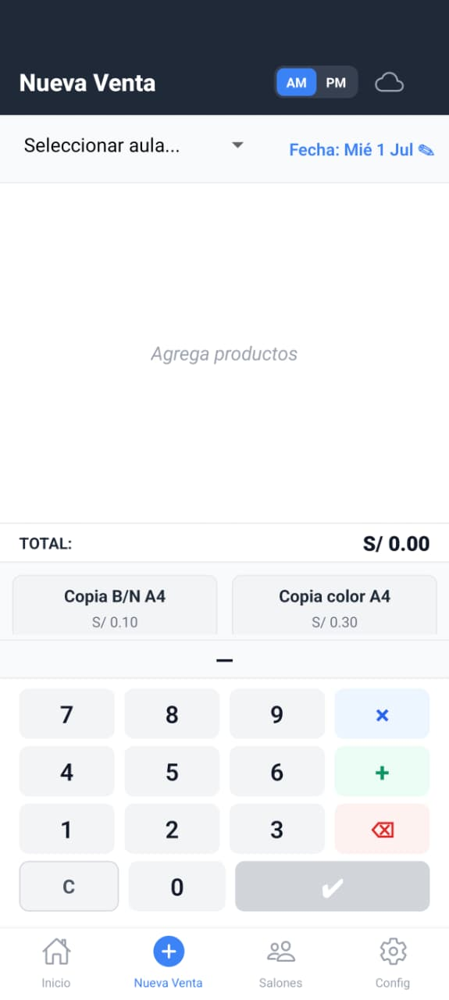
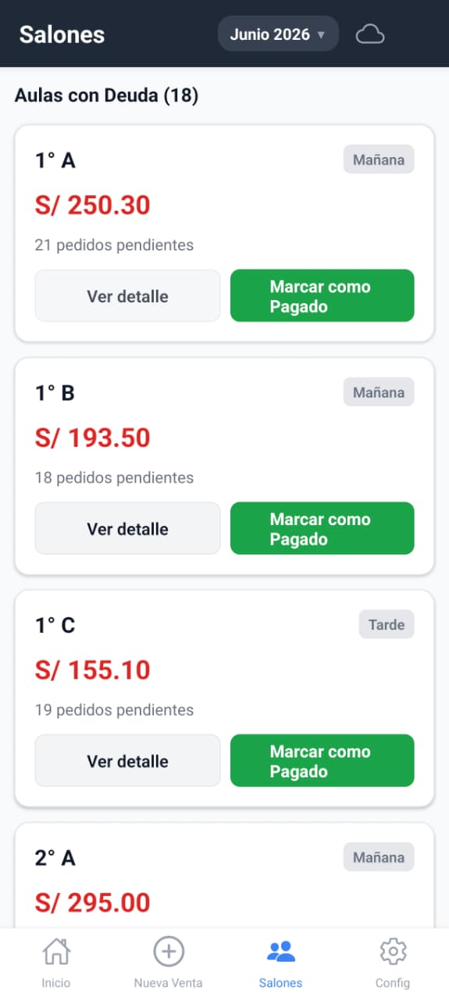
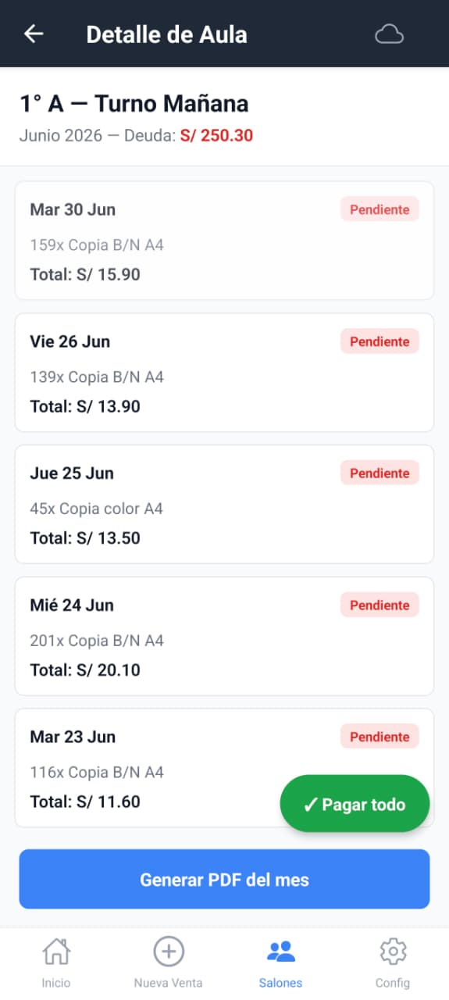
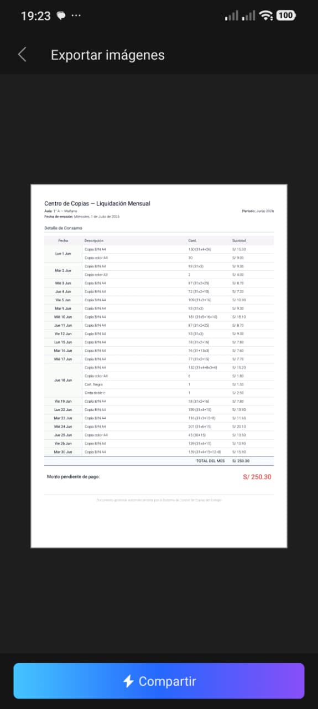
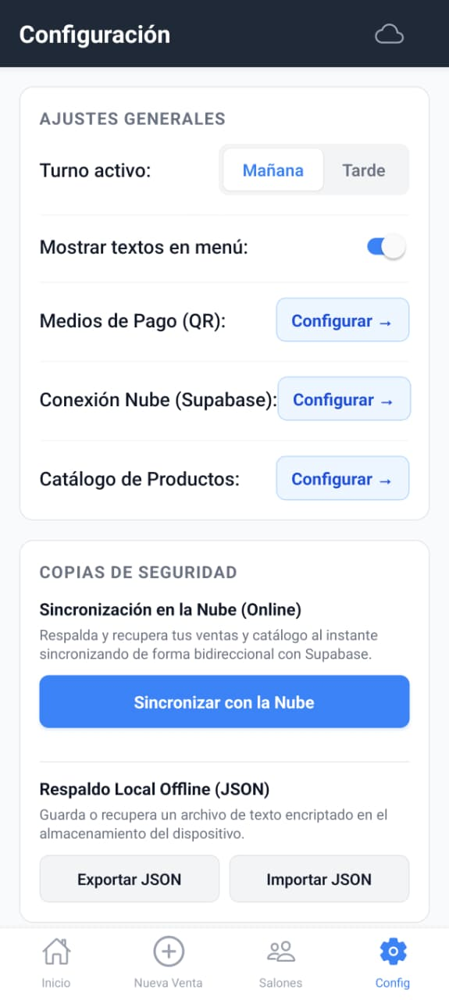

# 📋 POS CopyCenter — Sistema POS para Centros de Fotocopiado Escolares


---

## 📸 Pantallazos

> *Agrega aquí las capturas de pantalla de la aplicación para mostrar el impacto visual del proyecto.*

| | | |
|:---:|:---:|:---:|
| **Pantalla de inicio**<br/> | **Nueva Venta (POS)**<br/> | **Deudas por Aula**<br/> |
| **Detalle de Aula**<br/> | **Reporte PDF**<br/> | **Configuración**<br/> |

---

## ✨ La Historia Detrás de Este Proyecto

Mi mamá tiene un pequeño centro de fotocopiado dentro de un colegio. Durante años, llevó todas las cuentas **a mano**: anotaba en un cuaderno cada fotocopia que cada profesor pedía, y al final del mes sumaba hoja por hoja para saber cuánto le debía cada salón.

Era un proceso tedioso que le tomaba horas. Horas que perfectamente podía pasar con mi hermana y conmigo.

Un día, mientras la veía sumar columnas enteras de números con una calculadora en una mano y un cuaderno en la otra, pensé: *"Tiene que haber una mejor manera de realizar esto"*.

Así nació **POS CopyCenter**.

No es una app genérica de facturación. Es una herramienta construida **para ella**, pensando en su flujo de trabajo real:
- Los pedidos llegan en ráfagas durante los recreos (5 minutos para atender a 3 profesores)
- No siempre hay internet
- Los reportes tienen que ser claros porque los delegados de aula los revisan
- El respaldo tiene que ser automático porque un cuaderno se puede perder

Hoy mi mamá usa la app en su teléfono Android. Toca 3 botones, registra un pedido en menos de 10 segundos, y al final del mes genera un PDF con todo el detalle para cada salón. Lo comparto en GitHub porque sé que hay otros pequeños negocios de fotocopiado con el mismo problema.

---

## 🎯 ¿Qué Hace Esta App?

POS CopyCenter es un sistema POS (**Point of Sale**) offline-first para centros de fotocopiado dentro de colegios:

| Funcionalidad | Descripción |
|---|---|
| **Registro rápido de ventas** | Teclado numérico permanente. 3 toques = 1 venta. |
| **Gestión por aulas y turnos** | Cada salón (1°A, 3°B, etc.) tiene su propia cuenta por turno (Mañana/Tarde). |
| **Control de deudas mensuales** | Al final del mes, sabes exactamente cuánto debe cada aula. |
| **Batch Entry** | Transcribe pedidos pasados con su fecha real (cuaderno → app). |
| **Generación de PDF** | Reporte detallado por aula con QR de pago (Yape/Plin) incrustado. |
| **Sincronización en la nube** | Respaldo automático con Supabase cuando hay WiFi. |
| **Modo offline completo** | 100% funcional sin internet. La sincronización nunca bloquea. |
| **Anulación con auditoría** | Las ventas anuladas quedan registradas con motivo y timestamp. |

---

## 🏛️ Decisiones Arquitectónicas

### Offline-First como principio fundamental

```
App → SQLite Local (lectura/escritura inmediata)
       ↕ (en segundo plano, solo WiFi)
       Supabase (fuente de verdad para multi-dispositivo)
```

Toda operación se escribe primero en SQLite local. La sincronización con la nube es un proceso secundario que ocurre automáticamente cuando hay WiFi. **Sin internet, la app funciona igual.**

#### ¿Por qué offline-first y no solo online?

El centro de fotocopiado está dentro de un colegio. La cobertura móvil es irregular y el WiFi no siempre está disponible. Se requeria registrar ventas **en el momento**, no cuando llegue a casa. Una arquitectura puramente online simplemente no funciona aquí.

#### ¿Por qué SQLite local y no AsyncStorage / MMKV?

SQLite permite consultas complejas (JOINs, GROUP BY, agregaciones) que necesitamos para reportes mensuales. AsyncStorage es solo clave-valor — tendríamos que implementar un motor de consultas nosotros mismos. MMKV es rápido pero igual carece de capacidades relacionales. `expo-sqlite` nos da una base de datos relacional completa sin salir del ecosistema Expo.

#### ¿Por qué Supabase y no Firebase / Parse / servidor propio?

Supabase ofrece PostgreSQL con RLS, Auth, y APIs REST/Realtime en un solo producto. Comparado con Firebase: PostgreSQL permite consultas ad-hoc para reportes (Firebase Firestore tiene limitaciones severas en agregaciones). Comparado con servidor propio: cero administración de infraestructura. La capa gratuita es suficiente para este volumen de datos.

#### ¿Por qué Last-Write-Wins y no CRDT o resolución manual?

El negocio opera con una sola persona (mi mamá). La probabilidad de conflicto entre dos dispositivos editando el mismo registro simultáneamente es cercana a cero. LWW por `updated_at` es correcto y simple. Implementar CRDTs sería sobredimensionar el problema.

---

### Stack Tecnológico

| Capa | Tecnología | ¿Por qué esta y no otra? |
|---|---|---|
| **Framework** | React Native + Expo SDK 52 | Desarrollo multiplataforma (hoy Android, mañana iOS) con un solo código base. Expo elimina la configuración nativa manual (sin Xcode/Android Studio para desarrollo básico). |
| **Lenguaje** | JavaScript (JSX) | TypeScript agregaría una capa de complejidad al build que no se justifica para un equipo de 1 desarrollador. JS con JSDoc y PropTypes provee documentación suficiente. |
| **Base de datos local** | SQLite via `expo-sqlite` | Base de datos relacional completa embebida. Soporta JOINs, agregaciones y transacciones. AsyncStorage no es relacional; MMKV es solo clave-valor. |
| **Base de datos nube** | Supabase (PostgreSQL + Auth + RLS) | PostgreSQL permite SQL directo para reportes. Gratuito para este volumen. Auth y RLS incluidos. Firebase Firestore no soporta agregaciones nativas. |
| **Navegación** | React Navigation 6 (Bottom Tabs + Native Stack) | Estándar de facto en React Native. Las alternativas (React Native Navigation de Wix) tienen mejor performance pero requieren configuración nativa que Expo oculta. |
| **PDF** | `expo-print` (HTML → PDF) | Generación 100% local, sin servidor. Alternativas como `react-native-pdf-lib` requerirían configurar módulos nativos. |
| **Estado global** | React Context | La app tiene ~4 estados globales (DB, sync, config, venta). Redux o Zustand agregarían boilerplate innecesario. Context + hooks es suficiente. |
| **Hápticos** | `expo-haptics` | Feedback táctil silencioso en entorno ruidoso (recreo) donde no se escuchan sonidos de confirmación. |
| **Almacenamiento seguro** | `expo-secure-store` | Guarda el JWT de Supabase en el llavero/locker del SO. AsyncStorage no es seguro para tokens. |

#### ¿Por qué React Context y no Redux / Zustand / Jotai?

La aplicación tiene exactamente 4 estados globales: conexión a DB, sincronización, configuración y venta activa. Cada uno es un contexto independiente. Redux requeriría actions, reducers, slices — duplicación de lógica para un estado que apenas cambia fuera del POS. Zustand sería viable pero no agrega valor sobre Context + hooks para esta escala.

#### ¿Por qué botones ↑↓ en vez de Drag & Drop para reordenar productos?

`react-native-draggable-flatlist` tiene un historial documentado de incompatibilidades con nuevas versiones de Expo. El catálogo tiene 5-10 productos. Los botones subir/bajar son funcionalmente equivalentes, sin dependencias de terceros, y menos propensos a errores de gesto en un entorno de uso apresurado.

#### ¿Por qué INTEGER en centavos para dinero (y no FLOAT)?

Los números de punto flotante en JavaScript causan errores de redondeo: `0.1 + 0.2 !== 0.3`. En un reporte mensual con 200+ transacciones, esos errores se acumulan y destruyen la confianza en el sistema. Almacenar en centavos como entero evita este problema de raíz.

#### ¿Por qué una sola cuenta de Supabase (sin multi-usuario)?

El negocio tiene una sola operadora. Agregar autenticación multi-usuario, roles y permisos agregaría complejidad sin beneficio real. Si el negocio crece, se implementa entonces.

---

## 🚀 Cómo Empezar

### Prerrequisitos

- **Node.js 22+**
- **npm** o **pnpm**
- **Expo Go** (en tu teléfono) o **Android Emulator**
- **(Opcional) Android Studio** — solo para builds locales

```bash
# 1. Clonar
git clone https://github.com/IDemonSan/pos-copycenter.git
cd pos-copycenter

# 2. Instalar dependencias
npm install

# 3. Iniciar servidor de desarrollo
npx expo start

# 4. Escanear QR con Expo Go o presionar 'a' para emulador Android
```

---

## 📱 Compilación y Distribución

### Conceptos clave

- **AAB (Android App Bundle)**: Formato requerido por Google Play Store. Google lo firma y genera APKs optimizados por dispositivo.
- **APK universal**: Instalable directo que funciona en cualquier dispositivo Android. Se puede distribuir fuera de Play Store.
- **APKS**: Paquete generado por `bundletool` a partir de un AAB. Contiene APKs divididos por arquitectura.
- **Keystore**: Archivo `.jks` que firma digitalmente tu app. Sin la firma, Android no permite instalar actualizaciones sobre una versión anterior.

### Opción 1: EAS Build (sin Android Studio - larga cola de espera de los servidores de Expo de forma gratuita)

EAS Build compila en servidores de Expo. **No necesitas Android Studio instalado.**

```bash
# Instalar EAS CLI (una sola vez)
npm install -g eas-cli

# Iniciar sesión (abre navegador)
eas login

# Verificar que estás logueado
eas whoami
```

#### APK de prueba (distribución interna)

```bash
eas build --platform android --profile preview
```
- **Salida:** `.apk` universal listo para instalar en cualquier Android.
- **Uso:** Pruebas internas, distribución directa a usuarios.
- La primera vez te pedirá crear o subir un **keystore** (EAS lo gestiona por ti).

#### AAB para Google Play (producción)

```bash
eas build --platform android --profile production
```
- **Salida:** `.aab` listo para subir a Google Play Console.
- Incluye **auto-incremento de versión** configurado en `eas.json`.

### Opción 2: Build local con bundletool (desde AAB)

Requiere el **keystore** de tu app. Si ya compilaste con EAS Build, puedes descargar el keystore desde EAS:

```bash
eas credentials --platform android
```

#### Requisitos

- **Android SDK** instalado y configurado (`ANDROID_HOME`)
- **bundletool-all.jar** — descargar de [GitHub Releases de bundletool](https://github.com/google/bundletool/releases)
- **keystore.jks** — tu archivo de firma

#### 1. Generar el AAB (local)

```bash
npx expo prebuild --platform android
cd android
./gradlew bundleRelease
# → android/app/build/outputs/bundle/release/app-release.aab
```

O usa EAS Build (Opción 1) para obtener el `.aab`.

#### 2. Convertir AAB → APKS y firmar

```bash
java -jar bundletool-all.jar build-apks \
      --bundle app-release.aab \
      --output POS-COPYCENTER.apks \
      --ks keystore.jks \
      --ks-key-alias <alias-de-tu-keystore> \
      --ks-pass pass:<contraseña-del-keystore> \
      --key-pass pass:<contraseña-de-la-clave>
```

#### 3. Instalar en dispositivo conectado

```bash
java -jar bundletool-all.jar install-apks \
      --apks POS-COPYCENTER.apks
```

#### 4. Extraer APK universal (para distribución directa)

```bash
java -jar bundletool-all.jar build-apks \
      --bundle app-release.aab \
      --output POS-COPYCENTER.apks \
      --mode universal \
      --ks keystore.jks \
      --ks-key-alias <alias> \
      --ks-pass pass:<password> \
      --key-pass pass:<password>

# Cambiar extensión .apks a .zip y extraer → universal.apk
mv POS-COPYCENTER.apks POS-COPYCENTER.zip
unzip POS-COPYCENTER.zip -d pos-universal
# → pos-universal/universal.apk (o standalone.apk)
```

### iOS

Requisitos: **macOS** + **Xcode** + **Cuenta de Apple Developer** ($99/año).

```bash
# Generar IPA para TestFlight o App Store
eas build --platform ios --profile production
```

> Actualmente la app está enfocada en Android. La compilación iOS requiere configurar los assets nativos con `npx expo prebuild --platform ios` y ajustar capacidades como SecureStore en un equipo macOS.

### Gestión de Releases

Los artefactos compilados (APK, AAB) **no se suben al repositorio**. En su lugar:

1. Crea un **Release** en GitHub: `https://github.com/IDemonSan/pos-copycenter/releases/new`
2. Etiqueta con la versión (ej. `v1.0.0`)
3. Adjunta los archivos:
   - `POS-COPYCENTER-V2.aab` (para Play Store)
   - `POS-COPYCENTER-V2.apk` (para distribución directa)
4. Incluye notas de la versión con los cambios

> ⚠️ **Nunca subas al repositorio**: `keystore.jks`, `credentials.json`, `bundletool-all.jar`, `*.apk`, `*.aab`, `*.apks`. Están en `.gitignore`.

---

## 🧪 Tests

```bash
# Ejecutar todos los tests
npm test

# Con cobertura
npx jest --coverage

# Modo watch (desarrollo)
npx jest --watch
```

### Tests unitarios incluidos

| Archivo | ¿Qué prueba? |
|---|---|
| `src/utils/__tests__/expresiones.test.js` | Parseo, simplificación y normalización de expresiones matemáticas (30x3+15) |
| `src/hooks/__tests__/useCarrito.test.js` | Lógica del carrito: buffer numérico, multiplicación, fusión de productos, pagos |
| `src/database/queries/__tests__/ventas.test.js` | Pagos parciales FIFO, distribución de montos entre ventas |

### CI/CD

En cada push a `main` o PR, GitHub Actions ejecuta automáticamente:

```yaml
# .github/workflows/test.yml
- npm ci          # Instalación limpia
- npm run lint    # ESLint
- npm test        # Jest (70+ tests)
```

---

## 📁 Estructura del Proyecto

```
POS-CopyCenter/
├── App.js                        # Punto de entrada
├── app.json                      # Configuración Expo
├── eas.json                      # Perfiles de EAS Build
├── .github/workflows/test.yml    # CI (GitHub Actions)
│
├── src/
│   ├── components/               # Componentes UI reutilizables
│   │   ├── NumPad.jsx            # Teclado numérico del POS
│   │   ├── ProductButton.jsx     # Botón de producto con animación
│   │   ├── CartItem.jsx          # Línea del carrito
│   │   └── ...
│   │
│   ├── context/                  # React Contexts (estado global)
│   │   ├── DbContext.jsx         # Inicialización de SQLite
│   │   ├── VentaContext.jsx      # Estado de la venta activa
│   │   ├── SyncContext.jsx       # Estado de sincronización
│   │   └── ConfigContext.jsx     # Configuración persistente
│   │
│   ├── hooks/
│   │   ├── useCarrito.js         # Lógica del carrito de compras
│   │   └── __tests__/
│   │
│   ├── database/                 # Capa de datos
│   │   ├── schema.js             # Esquema de tablas SQLite
│   │   ├── migrations.js         # Migraciones atómicas
│   │   ├── seed.js               # Datos iniciales
│   │   └── queries/              # Queries SQL organizadas
│   │
│   ├── services/
│   │   ├── syncService.js        # Sincronización con Supabase
│   │   ├── syncWorker.js         # Worker de background
│   │   ├── pdfService.js         # Generación de PDF (expo-print)
│   │   ├── authService.js        # Sesión JWT con Supabase
│   │   ├── backupService.js      # Exportación de respaldo JSON
│   │   └── hapticService.js      # Feedback táctil unificado
│   │
│   ├── screens/                  # Pantallas de la app
│   │   ├── POSScreen.jsx         # Registro de ventas (core)
│   │   ├── HomeScreen.jsx        # Resumen del día
│   │   ├── SalonesScreen.jsx     # Deudas por aula
│   │   ├── AulaDetailScreen.jsx  # Detalle de un aula
│   │   └── ...
│   │
│   ├── navigation/
│   │   └── AppNavigator.jsx      # Bottom Tabs + Native Stacks
│   │
│   └── utils/
│       ├── expresiones.js        # Parseo de 30x3+15
│       ├── responsive.js         # Dimensiones adaptativas
│       └── __tests__/
│
└── especificacion_tecnica_v3.md  # Documentación de arquitectura
```

---

## 🛠️ Tareas de Desarrollo

```bash
# Linter
npm run lint

# Formatear código
npm run format

# Iniciar servidor de desarrollo
npx expo start

# Compilar para Android (requiere npx expo prebuild previo)
npx expo run:android

# Compilar para iOS (requiere macOS + Xcode)
npx expo run:ios
```

---

## 🤝 Contribuir

Si este proyecto te es útil o quieres mejorarlo, eres bienvenido. Algunas ideas:

- [ ] Soporte para tablets con layout adaptativo
- [ ] Exportar reportes a Excel
- [ ] Modo oscuro
- [ ] Múltiples usuarios/roles
- [ ] Backup automático programado
- [ ] Notificaciones de deuda vía WhatsApp
- [ ] Soporte iOS (TestFlight)

---

## 📄 Licencia

MIT — Usa este código libremente, aprende de él, mejóralo. Si te sirve, comparte el proyecto con alguien más que pueda necesitarlo.

---

*Hecho para mi mamá y para todos los que llevan cuentas en un cuaderno.*
